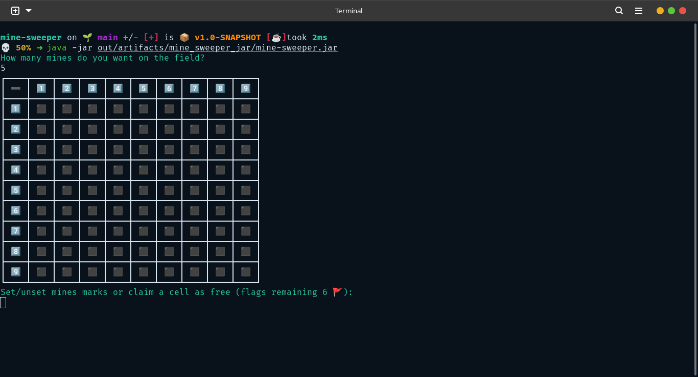
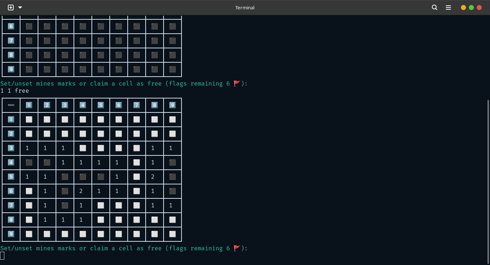
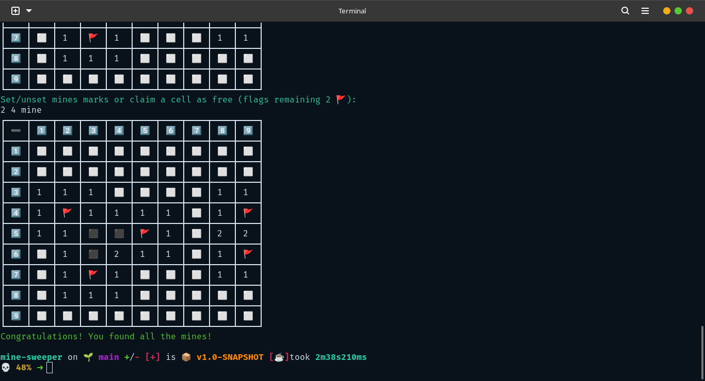
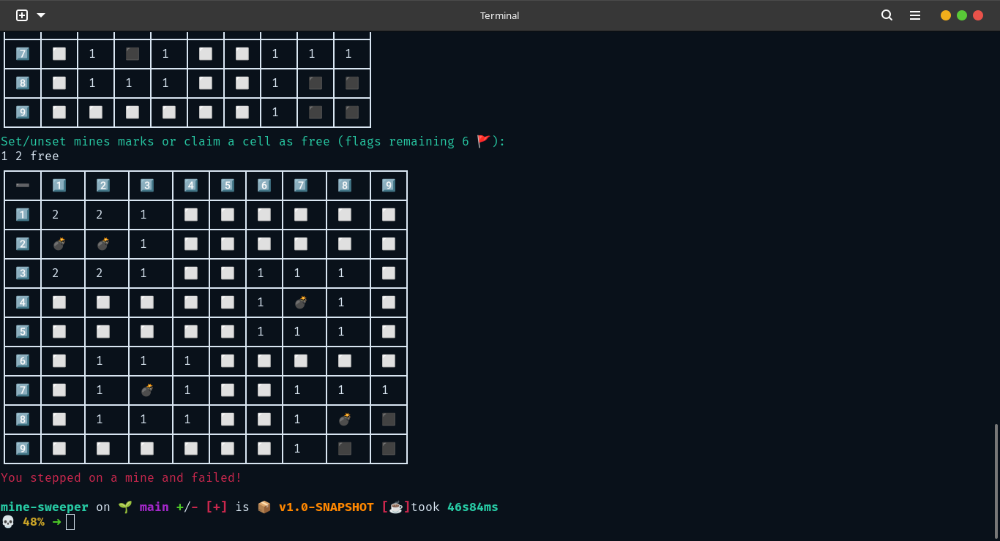

# Minesweeper Console Game

## About

As said in [Wikipedia](<https://en.wikipedia.org/wiki/Minesweeper_(video_game)>)
is a logic puzzle video game genre generally played on personal computers.
The game features a grid of clickable squares, with hidden "mines" scattered
throughout the board. The objective is to clear the board without detonating
any mines, with help from clues about the number of neighboring mines in each field.

Variants of Minesweeper have been made that expand on the basic concepts, such as
Minesweeper X, Crossmines, and Minehunt.
Minesweeper has been incorporated as a minigame in other games,
such as RuneScape and Minecraft's 2015 April Fools update.

## This Variant

This variant of the Game was made as a Project for [JetBrains Academy](https://www.jetbrains.com/academy/)
Kotlin Basics Track, with few customizations from me, such as:

- grid characters:

|  meaning   | original | my version |
|:----------:|:--------:|:----------:|
|    Mine    |   `X`    |    `💣`    |
| Unexplored |   `.`    |    `⬛`     |
|    Flag    |   `*`    |    `🚩`    |
|  Explored  |   `/`    |    `⬜`     |

- grid structure

|                 original                  |                            my version                            |
|:-----------------------------------------:|:----------------------------------------------------------------:|
| made via &#124; to separate between cells | actual table made by [mordant](https://github.com/ajalt/mordant) |

- validation for userInput as the Project didn't require any handling for user input either the number of mines or the coordinates of the moves

## How to play

- Firstly You're Prompted with the question: `How many mines do you want on the field? ` Acceptable values are in range from 1 to 80 but the real game usually take 38 mine
- Then You're repeatedly ask to make a move
  - place x ie column number then y row number
    - free: you want to explore that area, possibilities are:
      - already explored area -> won't do a thing
      - unexplored area -> will explore it and its neighbours
      - near mine -> will explore it only
      - flag -> will remove the flag and explore that area
      - mine -> you'll lose the game
    - mine: you want to put a flag on that area or remove one
  - ex: `1 1 free` or `2 3 mine`

## Why I didn't include `play again` option

Because I Believe this game to be addictive, and without that option
the player would have to rerun the game to play again which make it inconvenient to do so.

## Screenshots

